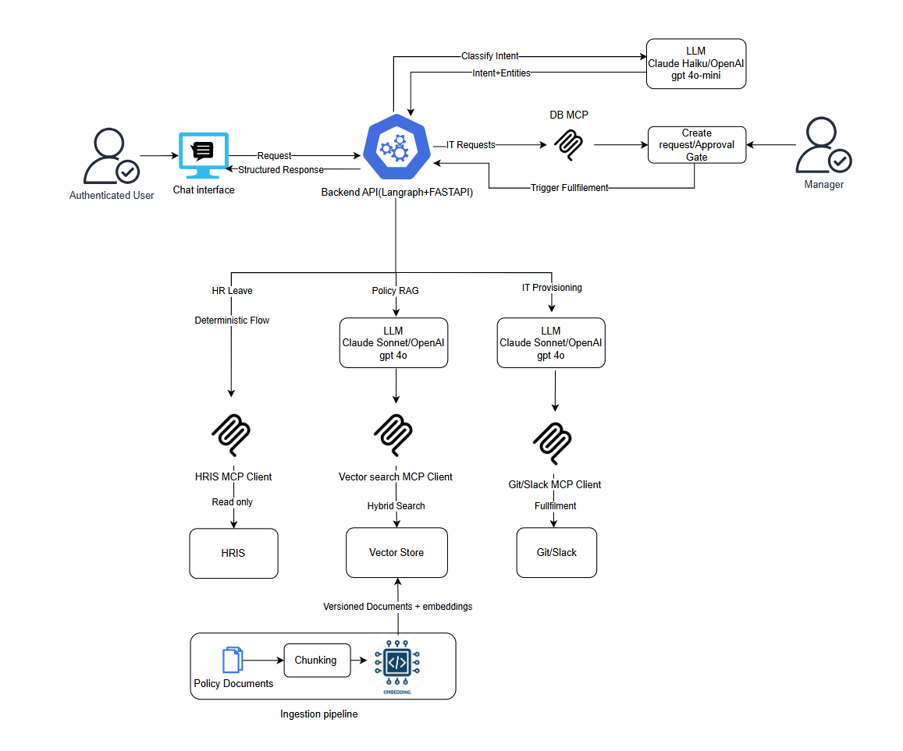

# Agentic HR Assistant

An AI-powered HR assistant that handles leave management, policy queries, and software access provisioning. Built with LangGraph, FastAPI, Streamlit, and a suite of self-hosted tools.

---

## What It Does

| Use Case | What happens |
|---|---|
| **Leave Balance** | Fetches real-time balances from NocoDB |
| **Apply for Leave** | Collects type & duration, calculates hours, validates balance, updates NocoDB |
| **Policy Questions** | Hybrid vector + full-text search over HR policy docs, graded answer with citations |
| **Software Access** | Eligibility check → access request → manager approval → auto-provision in Gitea/Mattermost |
| **Access Request Status** | Queries Postgres for request status joined with package details |

---

## Architecture



**Pipeline per intent:**

- `leave_balance` → resolve_user → leave_balance → compose → audit
- `leave_apply` → resolve_user → gather → calculate → update → compose → audit
- `policy_query` → rewrite → retrieve (hybrid RAG) → expand → grade+answer → compose → audit
- `software_provision` → resolve_user → map → eligibility → request → compose → audit
- `access_request_status` → resolve_user → query Postgres → compose → audit

---

## Running Locally

**Prerequisites:** Docker, Python 3.12+

```bash
# 0. From project root
cd /path/to/agentic_hr

# 1. Create and activate a single project virtual environment
python -m venv .venv
source .venv/bin/activate

# 2. Install dependencies (backend + UI + ingestion + tests)
pip install -r backend/requirements.txt -r ui/requirements.txt -r ingestion/requirements.txt pytest

# 3. Create env file
cp .env.example .env
# Fill required values in .env (see Environment Variables below)

# 4. Start infrastructure
docker compose up -d

# 5. Seed synthetic data (optional but recommended for demo flows)
python synthetic_data/generate.py
docker exec -i agentic_hr_postgres psql -U agentic_hr -d agentic_hr < synthetic_data/sql/seed.sql

# 6. Ingest HR policy PDFs
python -m ingestion.ingest

# 7. Start backend (terminal 1)
cd backend
uvicorn main:app --reload --port 8000

# 8. Start UI (terminal 2)
cd ../ui
streamlit run app.py --server.port 8501
```

Optional test run:

```bash
cd /path/to/agentic_hr
source .venv/bin/activate
pytest -q tests
```

The UI is at `http://localhost:8501`, backend at `http://localhost:8000`.

---

## Environment Variables

| Variable | Description |
|---|---|
| `LLM_PROVIDER` | LLM provider: `anthropic` or `openai` |
| `ANTHROPIC_API_KEY` | Anthropic API key (required when `LLM_PROVIDER=anthropic`) |
| `OPENAI_API_KEY` | OpenAI API key (required when `LLM_PROVIDER=openai`) |
| `POSTGRES_HOST` | PostgreSQL host |
| `POSTGRES_PORT` | PostgreSQL port |
| `POSTGRES_USER` | PostgreSQL user |
| `POSTGRES_PASSWORD` | PostgreSQL password |
| `POSTGRES_DB` | PostgreSQL database name |
| `NOCODB_URL` | NocoDB base URL (default: `http://localhost:8080`) |
| `NOCODB_API_TOKEN` | NocoDB API token |
| `NOCODB_BASE_ID` | NocoDB base ID (optional but recommended; avoids runtime base discovery) |
| `GITEA_URL` | Gitea instance URL |
| `GITEA_ADMIN_TOKEN` | Gitea admin token for provisioning |
| `MATTERMOST_URL` | Mattermost instance URL |
| `MATTERMOST_ADMIN_TOKEN` | Mattermost admin token |
| `LLM_FAST_MODEL` | Fast model for triage/rewrite/summarization |
| `LLM_STRONG_MODEL` | Strong model for answer composition |
| `EMBEDDING_MODEL` | Embedding model used by backend/ingestion |
| `EMBEDDING_DIMENSION` | Embedding vector dimension |
| `BACKEND_PORT` | Backend port setting (app config; default `8000`) |
| `GUARDRAIL_MODE` | Guardrail enforcement mode: `warn` (log only), `block_high_risk` (block SSN/card/bank terms), `strict` (block all PII); default `warn` |
| `GUARDRAIL_ENABLED_PII_CATEGORIES` | Comma-separated list of PII types to detect: `email`, `phone`, `ssn`, `credit_card`, `bank_account`, `date_of_birth`, `address`; default: all |
| `GUARDRAIL_DETECT_PROMPT_INJECTION` | Enable prompt-injection heuristics (default `true`) |
| `GUARDRAIL_AUDIT_REDACT_PII` | Redact PII from audit logs before persisting (default `true`) |
| `BACKEND_URL` | UI -> backend URL (default `http://localhost:8000`) |
| `SERVICE_HOST` | UI service host for links (default `localhost`) |
| `LOG_LEVEL` | Logging level for backend/ingestion (default `INFO`) |


## Project Structure

```
backend/
  api/                  FastAPI routers (chat, approvals)
  db/                   PostgreSQL helpers (HR, RAG, audit)
  graph/
    nodes/              LangGraph node implementations
    builder.py          Graph wiring
    edges.py            Intent routing
  llm/                  LLM client + prompt files
  mcp/                  NocoDB, Gitea, Mattermost clients
  models/               AgentState + API schemas
  main.py               FastAPI app entrypoint

ui/
  app.py                Streamlit app entrypoint
  pages/                Chat and approvals pages
  components/           Reusable UI components
  api_client.py         Backend API wrapper

ingestion/
  ingest.py             PDF -> chunks -> embeddings pipeline
  chunker.py            Parent/child chunking logic
  db.py                 policy_chunks upsert helpers
  embedder.py           Embedding model loader
  summarizer.py         Optional LLM summarization
  output_markdown/      Parsed markdown output

synthetic_data/
  generate.py           Synthetic employee/access data generator
  output/               Generated JSON files
  sql/seed.sql          PostgreSQL seed script

tests/
  test_*.py             Unit tests for API, graph nodes, DB, MCP clients
  conftest.py           Shared fixtures
  pytest.ini            Test configuration

docker-compose.yml      Local services (Postgres, NocoDB, Gitea, Mattermost)
init-db.sh              Local DB initialization helper
COMMANDS.txt            Runbook for local setup and execution
```

## Guardrails: PII Detection & Prompt-Injection Safeguards

The backend includes built-in guardrails to detect and handle sensitive data (PII) and prompt-injection attempts across the chat pipeline:

**Inbound Requests** — Scans employee messages for PII (email, phone, SSN, credit cards, bank accounts, DOB, addresses) and prompt-injection patterns (ignore instructions, roleplay, negation directives, SQL injection).

**LLM Prompts** — Sanitizes constructed prompts by redacting detected PII before sending to the LLM provider.

**LLM Responses** — Filters generated responses and redacts any PII that may have been accidentally included by the model.

**Audit Logs** — Optionally redacts PII from stored request/response text in the `audit_events` table.

### Guardrail Modes

- **`warn` (default)** — Log detections without blocking; proceed with sanitized/redacted text in LLM calls.
- **`block_high_risk`** — Block requests containing high-risk PII (SSN, credit cards, bank accounts) or prompt injection; allow low-risk PII with warnings.
- **`strict`** — Block any request or response containing detected PII or injection patterns.

Configure via `GUARDRAIL_MODE` environment variable. See [Environment Variables](#environment-variables) for per-category and per-feature toggles.

